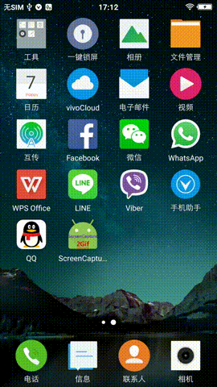

# ScreenCapture2Gif
- 录屏(已完成)
- 把录屏转为gif
- 默认保存在`Download`目录下
- 默认转换成的gif文件分辨率为`width 270, heigh 480`, 方便在github和coding.net上显示

## 效果图



## 原理图


- 从初始`MainActivity`可以点击右上角,进入`SettingsActivity`, 设置自定义信息
- 点击`MainActivity`开始`ScreenCaptureServie`, `MainActivity`隐藏不可见, `ScreenCaptureServide`开始录制屏幕,同时`Notification`显示当前录制状态和提供停止录制控制
- 从`Notification`停止录制`ScreenCaptureService`, 启动JNI ffmpeg convert video to gif
- `ScreenCaptureService`停止
- 默认录制的视频和生成gif文件都保存在手机存储的`Download`目录下, 可以在`SettingsActivity`中修改自定义位置

## Notes
### 至少android5.0
因为使用了在android5.0引入的接口`MediaProjection`

### show touch feedback
http://stackoverflow.com/questions/14374169/android-implement-show-touches-programatically
https://github.com/googlesamples/android-ScreenCapture

### transplant ffmpeg to android
https://github.com/tainzhi/ffmpeg-for-android-shared-library

### use ffmpeg jni to get gif from video
https://github.com/tainzhi/ffmpeg-jni-example
```
ffmpeg -ss 0 -t 20 -i /storage/sdcard0/Download/video.mp4 -vf scale=iw/2:ih/2 -gifflags -transdiff -r 15 -y /storage/sdcard0/Download/video.gif
ffmpeg -i /storage/sdcard0/Download/video.mp4 -gifflags -transdiff -r 15 -y /storage/sdcard0/Download/video.gif
```

## Todo
- [+] 绘制圆底start
- [+] Settings选项: name, resolution 480x270, delay 100
- [+] 判断当前的屏幕分辨率, 然后缩放
- [+] 绘制AppIcon(Android图标+GIF)
- [+] Settings: from Video or from pictures
- [+] notification
- [+] video to gif
- [ ] Martial Design
- [ ] 后台执行任务
- [ ] gif drawable

## References
[GifAssistant](https://github.com/dxjia/GifAssistant)
[Record Screen: Telecine](https://github.com/JakeWharton/Telecine)
